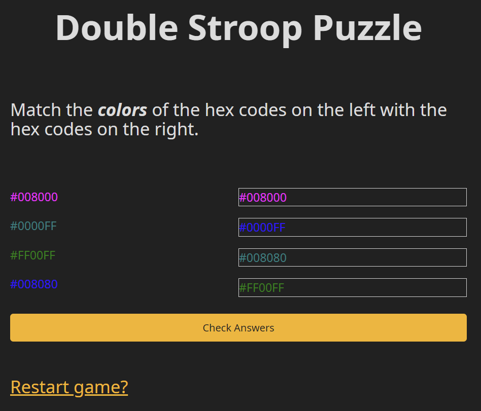

# Double Stroop Puzzle

This is a "Double Stroop Puzzle". In a [Stroop puzzle](https://en.wikipedia.org/wiki/Stroop_effect), you have to say the color of the word, not the word itself. In a Double Stroop puzzle, you have two columns of colored hex-codes, and you have to match the hex-code of one column with the *color* of the hex-codes of the other column.

I can only wish this is as painful for you to play as it was for me to debug.

Just open `index.html` in your browser to play.

